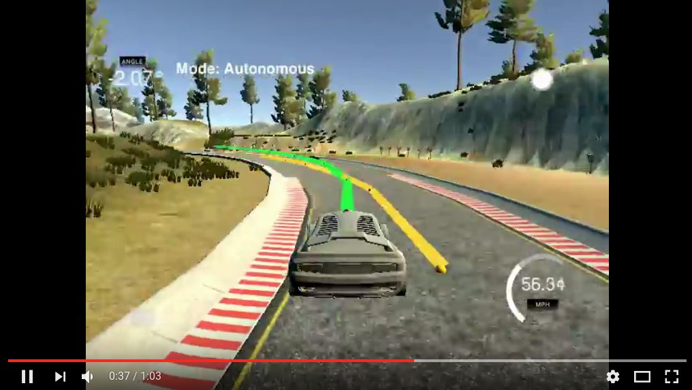

[image1]: ./imgs/local_minimum.gif "Local Minimum Example"
[image2]: ./imgs/bicycle.jpg "Bicycle model of a car"
[image3]: ./imgs/reference.png "Car and trajectories"
[image4]: ./imgs/error.png "Optimization stuck in local minimum"

# CarND-Controls-MPC
Self-Driving Car Engineer Nanodegree Program
---

## Introduction 
This project is a part the second semester of Udacity's Self-Driving Car Nanodegree. The goal is to apply the model predictive control (MPC) to the simulated car. The MPC is robust control algorithm, and it can be applied to systems with delays since MPC looks into the future.  To reach the goal of driving a car, first, we go into the theory of MPC to see how it works and all its ingredients. After that, there is a word on the simplified bicycle model which was used to describe the kinematics of the car. Finally, we will go through the process of implementation and few of its specific features. 

## MPC
MPC stands for model predictive control. It is an advanced model-based control method. In order to be able to apply this method, the plant model is needed. MPC works by optimizing the control signal at current and several future timeslots, in order to minimize a cost function over some time finite horizon. The optimization is performed at each timestamp, the solution of the optimization problem is used as a control signal. The cost function is usually a sum of tracking error over some finite horizon and magnitude of control signals. The results is that there is a tradeoff between tracking error and smoothness of the dynamical behavior. MPC is robust against time delays and can be used for complex systems since it takes into account a future of the system and influence on current control on subsequent motion of the system. Also, it can take into account the control signal saturation which is quite important for planning future behavior. The only downside of the MPC is that it can be computationally expensive and might take a substantial amount of time to solve. Also, the model of the system might be unknown and difficult to obtain. 

Let's say we need to controll the discreete system  with the state **x** and controll input **u** with the dynamics of the system given by:

and with output calculated using:

so that system output **y** needs to follow reference trajectory **r**. The cost function that needs to be minimized is:

where ***T*** is the time horizon. Parameter ***lambda*** is used to set the tradeof between the tracking error and high controll values.

This system is continuous in time, but the real controllers run at discrete timestamps. So we can discretize the system:

and 

So now the cost function that we need to minimize at the timestamp *k* becomes:

This kind of problem is well known and can be solved using standard optimization techniques. The solution of this equation is controll signal at all timestamps within the horizon. 

### Linear systems
For the linear systems, the functions **f** and **g** are linear in state variable **x** and controll variable **u**. The state space model of such system is:

For such as system, the cost function which needs to be optimized is ***quadratic***. That means, that it is ***convex*** and ***unique*** solution to such optimization problem is ***finite*** and ***always exists***. This problem is very well known and finding its minimum can be efficiently using [quadratic programing](https://en.wikipedia.org/wiki/Quadratic_programming)

### Nonlinear systems
Unfortunately, the systems are more likely to be non-linear, which is the case for what we are trying to solve here. In such a case the cost function might not be convex and can have multiple minima or might not have a minimum at all. The procedures for solving such a problem might get stuck in local minimum without finding the real global minimum which yields suboptimal results. Another big problem is that there is no way that we can tell if we are in local or global minimum. This brings up the danger, that the optimization would get stuck in high local minimum which could produce highly undesired behavior of the system, and potentially lead to catastrophic failure. One way that we could avoid that is to narrow our search, by using expert knowledge of system we are trying to control. In other words, we could provide, on the basis of our knowledge, the information on where the minimum should be and the optimization procedure would find it. 

| Example of local and global minimum  |
|--------------------------------------|
|![alt text][image1]                   |

## Bicycle model of the car

In order to apply the MPC to the system, we need to describe its state by selecting proper state variables and then describe how the state changes based on the control inputs. For that purpose, the approximate bicycle model will be used. The model is an approximation of one described in [this paper](http://www.me.berkeley.edu/~frborrel/pdfpub/IV_KinematicMPC_jason.pdf). The schematics of a model are given in the following figure. 

| Bicycle model of a car |
|------------------------|
|![alt text][image2]     | 

The state of a car is defined by its position in both *X* and *Y* directions, denoted by *x* and *y*, it's total velocity denoted by *v* and its orientation denoted by *psi*. The control variables are the acceleration of the car *a* and the front steering angle *delta*. In this model, it is assumed that *beta* is much smaller than steering angle *delta*. So the dynamics of the system would be given by:

where Lr is a distance from the back axle to the center of mass of the car. It is clear that this model is quite non-linear, meaning that we could miss the global optimal solution. We will see when that happens, and how to avoid such a situation later on. 

## Implementation

In this section, the brief discussion of the implementation is going to be given. 

The trajectory that the car should follow is given by the set of waypoints expressed in world coordinate frame. On the image below the waypoints are represented by yellow dots. The MPC optimization would be performed in local coordinate frame of the car, because that makes things a bit cleaner, since cars coordinate and angle in local coordinate frame are zero. To transform position of waypoint (*xw*, *yw*) to the local coordinate frame, following formula has to be applied:

where *x*, *y* and *psi* is position and orientation of the car in world coordinate frame. Once the coordinates for all the waypoints have been trasformed to local coordinate frame, the 4th order polynomial is fit to it. The estimates the *y* position of the referent trajectory based on *x* position. So the referent trajectory is given by:

where *a0*-*a3* are parameters of the polynomial which are calculated using fitting procedure

| Car, desired trajectory (yellow line) and MPC optput (green line) |
|------------------------|
|![alt text][image3]     | 

### The cost function

The car has to follow the desired trajectory and maintaing constant predefined speed. The tracking error is shown on the image above. The speed error is calculated as a diference between predefined *vr* and curent *v* speed. Also in order to obtain the smooth operation, the controll inputs should be as low as possible. Setting high steering angle might yield jerky behavior. As a result the used cost function is:

The parameters *alpha*, *beta*, *lambda* and *nu* are used to give relative weiths to errors. Reason for that is the different scales for all the variables, for example the steering angle *delta* is in range *[-1, 1]* while the referent *vr* speed might be close to *60mph*.

So to obtain the controll input we have to solve following optimization problem

As a result the future N steering angles and accelerations are calculated. The first steering angle and acceleration are passed as a control value to the simulator. 

Let's recall that this cost function is nonconvex and nonlinear, meaning that the optimization procedure might fail to find **global minimum** but gets stuck in some **local minimum**. That actually happened to me several times when trying to control a car using this approach. Here is a screenshot from the simulator showing exactly that:

| Optimization stuck in local minimum |
|------------------------|
|![alt text][image4]     | 

To avoid such a problem the search space needs to be minimized. Since the car should go forward always and should not make U-turn, such a constraint would be added to our MPC optimization problem. It is implemented by limiting the orientation *psi* to be less than 115 degrees during the whole MPC horizon, defined by a number of samples N. As a result, the final optimization problem would look like:

### Receding horizon
Receding horizon is the amount of time that MPC looks into the future. In our case that is the product of a number of samples, we look into the future N and sampling time dt. 
Since one of the requirements is that the MPC is robust against 100-millisecond delay, it didn't make sense to make the sampling rate any faster. Also, making it close to 100 milliseconds made the car oscillate, and eventually veer off track. The delay caused the instability. So the final dt was chosen to be 500 milliseconds. I didn't go much higher since that would create discretization quite inaccurate, and our model would be very different from the real one. The number of samples N was chosen on the basis of amount of reference trajectory provided. The simulator provides next portion trajectory, the N is chosen so that in the receding horizon the car covers most of the provided trajectory. It would not make sense to go above that since we are unaware where the car should go. Unfortunately the length of the reference trajectory provided by the simulator changes so sometimes the MPC trajectory is even longer than the referent one. 

The final result is shown below:

## Discussion
The MPC performed quite well on a given problem. The car was able to drive on the provided track with the speed of 60mph. It was noticed that the car actually cuts some of the sharp corners. The probable reason for that was that high steering angles were penalized. The problem with this model is that it does not take full dynamics into consideration, namely the tire interaction with the ground. It might happen that the ride shown in the video above would be impossible if the full dynamics was considered, and the car would slide off track in some of sharper bends. One improvement to described approach would be to have the speed based on the curvature of the road. For that, we will need longer horizon, so the car can start breaking on time. 

---

## Dependencies

* cmake >= 3.5
 * All OSes: [click here for installation instructions](https://cmake.org/install/)
* make >= 4.1
  * Linux: make is installed by default on most Linux distros
  * Mac: [install Xcode command line tools to get make](https://developer.apple.com/xcode/features/)
  * Windows: [Click here for installation instructions](http://gnuwin32.sourceforge.net/packages/make.htm)
* gcc/g++ >= 5.4
  * Linux: gcc / g++ is installed by default on most Linux distros
  * Mac: same deal as make - [install Xcode command line tools]((https://developer.apple.com/xcode/features/)
  * Windows: recommend using [MinGW](http://www.mingw.org/)
* [uWebSockets](https://github.com/uWebSockets/uWebSockets) == 0.14, but the master branch will probably work just fine
  * Follow the instructions in the [uWebSockets README](https://github.com/uWebSockets/uWebSockets/blob/master/README.md) to get setup for your platform. You can download the zip of the appropriate version from the [releases page](https://github.com/uWebSockets/uWebSockets/releases). Here's a link to the [v0.14 zip](https://github.com/uWebSockets/uWebSockets/archive/v0.14.0.zip).
  * If you have MacOS and have [Homebrew](https://brew.sh/) installed you can just run the ./install-mac.sh script to install this.
* [Ipopt](https://projects.coin-or.org/Ipopt)
  * Mac: `brew install ipopt --with-openblas`
  * Linux
    * You will need a version of Ipopt 3.12.1 or higher. The version available through `apt-get` is 3.11.x. If you can get that version to work great but if not there's a script `install_ipopt.sh` that will install Ipopt. You just need to download the source from [here](https://github.com/coin-or/Ipopt/releases).
    * Then call `install_ipopt.sh` with the source directory as the first argument, ex: `bash install_ipopt.sh Ipopt-3.12.1`. 
  * Windows: TODO. If you can use the Linux subsystem and follow the Linux instructions.
* [CppAD](https://www.coin-or.org/CppAD/)
  * Mac: `brew install cppad`
  * Linux `sudo apt-get install cppad` or equivalent.
  * Windows: TODO. If you can use the Linux subsystem and follow the Linux instructions.
* [Eigen](http://eigen.tuxfamily.org/index.php?title=Main_Page). This is already part of the repo so you shouldn't have to worry about it.
* Simulator. You can download these from the [releases tab](https://github.com/udacity/CarND-MPC-Project/releases).

## Basic Build Instructions

1. Clone this repo.
2. Make a build directory: `mkdir build && cd build`
3. Compile: `cmake .. && make`
4. Run it: `./mpc`.

## Tips

1. It's recommended to test the MPC on basic examples to see if your implementation behaves as desired. One possible example
is the vehicle starting offset of a straight line (reference). If the MPC implementation is correct, after some number of timesteps
(not too many) it should find and track the reference line.
2. The `lake_track_waypoints.csv` file has the waypoints of the lake track. You could use this to fit polynomials and points and see of how well your model tracks curve. NOTE: This file might be not completely in sync with the simulator so your solution should NOT depend on it.
3. For visualization this C++ [matplotlib wrapper](https://github.com/lava/matplotlib-cpp) could be helpful.

## Editor Settings

We've purposefully kept editor configuration files out of this repo in order to
keep it as simple and environment agnostic as possible. However, we recommend
using the following settings:

* indent using spaces
* set tab width to 2 spaces (keeps the matrices in source code aligned)

